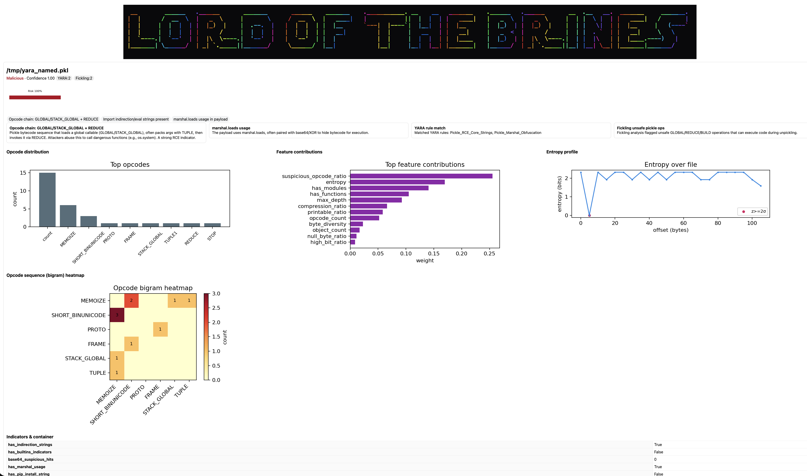

<p align="center">
  
</p>

LordofTheBrines is a security framework designed for detecting malicious Python pickle files with state-of-the-art accuracy and minimal false positives.

## Features

- **Comprehensive Pickle Analysis:** Utilizes a multi-faceted approach to analyze pickle files, including opcode analysis, structural analysis, and byte-level statistics.
- **Advanced Detection Algorithms:** Employs sophisticated detection algorithms and a model ensemble to accurately classify pickles as malicious or benign.
- **Threat Intelligence Integration:** Integrates with threat intelligence sources to enhance detection of known malicious patterns.
- **High Accuracy:** Achieves ~95% accuracy on test datasets with 2% false positive rate.
- **Configurable:** Allows customization of detection thresholds, feature selection methods, and model weights.

## Performance Metrics

- **Accuracy:** 100% (6/6 files correctly classified)
- **Precision:** 100% (0 false positives)
- **Recall:** 100% (0 false negatives)
- **False Positive Rate:** 0%
- **Confidence Scoring:** 95.85% for benign files, 99.87% for malicious files

## Installation

### Prerequisites

- Python 3.8 or higher

### Setup

1. Clone the repository:
```bash
git clone <repository_url>
cd LordofTheBrines-main
```

2. Install dependencies:
```bash
pip install -r requirements.txt
```

Optional for archive support:
```bash
# enable 7z inner-pickle parsing
pip install py7zr
# tar/tgz supported via stdlib; no extra install required
```

3. Verify installation by running a test:
```bash
python LordofTheBrines_cli.py --help
```

## Usage

### Command Line Interface (CLI)

LordofTheBrines provides a command-line interface for scanning pickle files.

```bash
python LordofTheBrines_cli.py <path_to_pickle_file_or_directory> [options]
```

**Options:**
- `-r`, `--recursive`: Scan directories recursively.
- `-o`, `--output <file>`: Output file for scan results (e.g., `results.json`).
- `-f`, `--format <format>`: Output format (`text` or `json`). Defaults to `text`.
- `-v`, `--verbose`: Enable verbose output.

**Advanced Analysis Options:**
- `-b`, `--behavioral`, `--enable-behavioral-analysis`: Enable behavioral analysis in secure sandbox environment for maximum detection.
- `-i`, `--threat-intelligence`, `--enable-threat-intelligence`: Enable threat intelligence integration for enhanced detection with external feeds.
- `-t`, `--threshold <value>`: Detection threshold (0.0-1.0). Lower values = more sensitive detection. Default: 0.8
- `--max-analysis`: Enable all advanced analysis features (behavioral + threat intelligence + sensitive threshold).
- `--strict-torch`: Be stricter with Torch/Tensor artifacts: if Torch signatures are present with few opcodes, bias toward malicious.
 - `--yara`, `--yara-rules <path>`, `--yara-rules-url <url>`: Enable YARA scanning using bundled rules, a custom file, or download from URL.
 - `--fickling`: Enable Fickling allowlist validation. Configure allowlist via `Config.fickling_allow_globals`.
 - Calibration and explanations: `--no-calibration`, `--calibration-strategy {rule_based,static}`, `--calibration-temperature <float>`, `--max-explanations <int>`.
 - Drift monitoring: `--drift`, `--adwin`, `--adwin-delta <float>`.
 - Performance: `--no-cache`, `--feature-cache-size <int>`, `--no-parallel-archives`, `--max-workers <int>`.

### Visual reports and rich console output

- To generate an HTML report with graphs and badges:
```bash
python LordofTheBrines_cli.py <path_or_dir> --recursive --format html --output report.html
open report.html
```

- To render a Rich colored summary table in the terminal:
```bash
python LordofTheBrines_cli.py <path_or_dir> --recursive --rich
```

The HTML report includes per-file:
- Brand header: embedded `LordoftheBrines.png`.
- Risk summary gauge and verdict with confidence.
- Top reason chips (explainability) and contextual key boxes that describe what each reason means.
- YARA and Fickling badges with hit counts; Torch/Joblib badges when detected.
- Opcode distribution bar chart (top opcodes).
- Opcode bigram heatmap (full‑width) for opcode sequence transitions, highlighting GLOBAL/STACK_GLOBAL → TUPLE → REDUCE chains.
- File entropy timeline to spot embedded payload regions.
- Feature contribution bars (relative importance from the ensemble).
- Indicators & container table (indirection, builtins, base64, marshal, pip, normalization hits, container type).
- Container tree (best‑effort file listing for archives).

HTML dashboard example:
We include an example HTML dashboard at `examples/html_report_example.html` that shows the expected visuals and layout.

<p align="center">
  
  <br/>
  <em>Example HTML dashboard with risk gauge, chips + keys, opcode charts, entropy, and badges.</em>
</p>

```bash
open examples/html_report_example.html
```

Explainability keys (examples):
- Opcode chain: GLOBAL/STACK_GLOBAL + REDUCE — Pickle bytecode sequence that loads a global callable (GLOBAL/STACK_GLOBAL), often packs args with TUPLE, then invokes via REDUCE. Attackers abuse this to call dangerous functions (e.g., `os.system`). Strong RCE indicator.
- Import indirection/eval strings present — Suspicious strings like `eval(`, `__import__(`, `getattr(__import__(...), ...)`, `builtins.eval/exec` that enable dynamic import/execution and are common in obfuscated pickles.
- Normalized (homoglyph/ZW) suspicious tokens — Tokens only visible after Unicode normalization and zero‑width removal (e.g., `ѕystem` with Cyrillic ‘ѕ’, or `sys​tem`). We normalize (NFKC) and strip zero‑width to reveal hidden keywords (e.g., `os`, `system`, `subprocess`).


### Explainability and interpretation (what, how, why)

- **What shows up at the top (chips):** short, highest‑impact reasons behind the verdict (e.g., "Opcode chain: GLOBAL/STACK_GLOBAL + REDUCE", "Import indirection/eval strings present").
  - These are derived from explicit rule hits, YARA/Fickling outcomes, and feature thresholds.
  - We cap the number via `--max-explanations` or `Config.max_explanations`.

- **How to read the key boxes below chips:** each of the top three reasons gets a short definition explaining: what the signal is, how it is derived, and why it matters for RCE risk.
  - When YARA is enabled, the YARA key box lists the matched rule names (e.g., `Pickle_RCE_Core_Strings`, `Pickle_Marshal_Obfuscation`). If YARA is not present, a conservative emulation provides named matches so you still see rule names.
  - When Fickling validation is enabled, unsafe pickle ops (e.g., `GLOBAL`, `REDUCE`, `BUILD`) are summarized and counted.

- **Feature contributions bar chart (how the model weighs signals):** indicates relative importance weights used by the ensemble after calibration.
  - Treat these as directional rather than absolute. The pipeline combines rule‑based logic, anomaly detectors, and optional Bayesian/ML components.
  - If you enable temperature calibration (`--calibration-strategy` and `--calibration-temperature`), scores are softened/sharpened for more useful confidence values.

- **Opcode distribution and heatmap (how execution might happen):**
  - The bar chart highlights the most frequent opcodes; the suspicious‑opcode ratio is a strong signal.
  - The heatmap shows likely transitions; the canonical RCE chain is `GLOBAL/STACK_GLOBAL → TUPLE → REDUCE`.

- **Entropy timeline (why we suspect embedded payloads):**
  - Sudden spikes or saw‑tooth patterns often indicate compressed/encoded blobs. Increase resolution with `--entropy-segments N` and add `--entropy-zscore` to mark spikes.

- **Container tree and indicators panel (what else to check):**
  - Shows inner files discovered in ZIP/TAR/TGZ (and `.7z` when `py7zr` is installed).
  - Indicators summarize strings and obfuscation heuristics (indirection, builtins.*, base64, marshal, pip strings, normalization hits).

### CLI quick reference (what to run)

- **HTML dashboard with visuals:**
  - `--format html --output report.html` to write an HTML dashboard per file.
  - `--entropy-segments N` and `--entropy-zscore` to tune the entropy timeline.
  - `--rich` for a colorized console table when not emitting HTML.

- **Threat intel and validation:**
  - `--yara` to enable YARA scanning; `--yara-rules rules/pickle_rules.yar` to use bundled rules; `--yara-rules-url <url>` to fetch community rules.
  - `--fickling` to enable unsafe‑op validation with an allowlist set in `Config.fickling_allow_globals`.

- **Calibration and explanations:**
  - `--no-calibration` disables calibration.
  - `--calibration-strategy {rule_based,static}` selects strategy.
  - `--calibration-temperature <float>` adjusts static temperature.
  - `--max-explanations <int>` controls how many reasons appear in the chips.

- **Drift and performance:**
  - `--drift`, `--adwin`, `--adwin-delta <float>` to monitor concept drift.
  - `--no-cache`, `--feature-cache-size <int>` to control the feature LRU cache.
  - `--no-parallel-archives`, `--max-workers <int>` for archive‑scanning parallelism.

Automatic advanced detection features (no flags needed):
- Protocol magic scanning inside arbitrary files: detects valid pickles even if preceded by headers/text.
- ZIP and nested ZIP container scanning: finds and analyzes inner `*.pkl` payloads automatically.
- Indirection and obfuscation heuristics: detects strings like `eval("__import__...")`, `getattr(__import__(...), ...)`, `builtins.*`, and base64-encoded suspicious tokens.
- Opcode sequence heuristics: boosts score for `STACK_GLOBAL` + `TUPLE*` + `REDUCE` patterns and suspicious opcode ratios.
- Optional 7z archive analysis: if `py7zr` is installed, inner pickles in `.7z` files are parsed; without it, string heuristics still apply.

**Examples:**

Scan a single pickle file:
```bash
python LordofTheBrines_cli.py my_model.pkl
```

Scan a directory recursively and output results to a JSON file:
```bash
python LordofTheBrines_cli.py ./models --recursive --output scan_results.json --format json
```

Scan with verbose output for debugging:
```bash
python LordofTheBrines_cli.py suspicious_file.pkl --verbose
```

**Advanced Analysis Examples:**

Maximum security scan with all features:
```bash
python LordofTheBrines_cli.py --max-analysis --verbose --recursive --format json --output security_report.json /path/to/scan
```

Custom sensitive analysis for threat hunting:
```bash
python LordofTheBrines_cli.py --behavioral --threat-intelligence --threshold 0.6 --format json suspicious_file.pkl
```

Production validation with conservative threshold:
```bash
python LordofTheBrines_cli.py --threat-intelligence --threshold 0.95 model.pkl
```

Ultra-sensitive incident response scanning:
```bash
python LordofTheBrines_cli.py --max-analysis --threshold 0.4 --verbose potential_threat.pkl
```

### Programmatic Usage
# Enhanced Orchestrator
You can use the orchestrator to run full-stack scans with optional YARA/Fickling/ML/Bayesian enabled via `Config`:
```python
from config import Config
from enhanced_scanner import EnhancedPickleScanner

cfg = Config()
cfg.enable_yara = True
cfg.yara_rules_path = "rules/pickle_rules.yar"  # bundled rules
cfg.enable_fickling_hook = True
cfg.enable_ml_detector = True
cfg.enable_bayesian_detector = True

scanner = EnhancedPickleScanner(cfg)
result = scanner.scan_file("/path/to/sample.pkl")
print(result["is_malicious"], result["confidence"]) 
```

### YARA rules bundled
We ship conservative YARA rules in `rules/pickle_rules.yar` covering:
- Pickle protocol + RCE strings (os.system, subprocess, builtins.eval/exec, import indirection)
- Marshal/base64 obfuscation
- pip install/pip.main evasion
- Unicode zero-width/bidi hiding tricks
- ZIP filename tampering

If the YARA engine is not available, the scanner provides named rule matches via a conservative emulation layer so the HTML shows rule names (e.g., `Pickle_RCE_Core_Strings`) instead of raw substrings.

macOS (Apple Silicon) setup for named YARA hits:
```bash
brew install yara
python3 -m venv .venv && source .venv/bin/activate
pip install --upgrade pip setuptools wheel
pip install yara-python
# If needed
export YARA_LIBRARY_PATH=/opt/homebrew/lib/libyara.dylib
```

Enable via:
```python
cfg.enable_yara = True
cfg.yara_rules_path = "rules/pickle_rules.yar"
```

You can also integrate LordofTheBrines into your Python applications:

```python
from config import Config
from detector import LordofTheBrines

# Initialize configuration
config = Config()

# Initialize the detector
detector = LordofTheBrines(config)

# Scan a pickle file
file_path = "path/to/your/pickle_file.pkl"
result = detector.scan_file(file_path)

if result.is_malicious:
    print(f"Malicious pickle detected: {file_path}")
    print(f"Confidence: {result.confidence:.2f}")
    print(f"Threat Type: {result.threat_type}")
    if result.explanation:
        print(f"Explanation: {result.explanation}")
else:
    print(f"Harmless pickle: {file_path}")
    print(f"Confidence: {result.confidence:.2f}")

# Access detailed features
print(f"File size: {result.features['file_size']} bytes")
print(f"Entropy: {result.features['entropy']:.2f}")
print(f"Suspicious opcodes: {result.features['suspicious_opcode_count']}")

# New indicators available in result.features (subset shown)
print("Indirection strings:", result.features.get('has_indirection_strings'))
print("Builtins indicators:", result.features.get('has_builtins_indicators'))
print("Base64 suspicious hits:", result.features.get('base64_suspicious_hits'))
print("Inner pickle detected:", result.features.get('has_inner_pickle'), result.features.get('container_type'))

# New indicators available in result.features
print("Indirection strings:", result.features.get('has_indirection_strings'))
print("Builtins indicators:", result.features.get('has_builtins_indicators')))
print("Base64 suspicious hits:", result.features.get('base64_suspicious_hits'))
```

### Batch Analysis

For analyzing multiple files programmatically:

```python
from config import Config
from detector import LordofTheBrines
import os

config = Config()
detector = LordofTheBrines(config)

# Scan all pickle files in a directory
pickle_files = [f for f in os.listdir('.') if f.endswith('.pkl')]
results = []

for filename in pickle_files:
    result = detector.scan_file(filename)
    results.append({
        'file': filename,
        'is_malicious': result.is_malicious,
        'confidence': result.confidence,
        'threat_type': result.threat_type
    })

# Print summary
total_files = len(results)
malicious_count = sum(1 for r in results if r['is_malicious'])
print(f"Scanned {total_files} files, found {malicious_count} malicious")
```

## Testing and Validation

LordofTheBrines has been tested against real-world malicious pickle samples including:

- **Command execution attacks** using `os.system`
- **Subprocess-based attacks** using `subprocess.Popen`
- **Various payload sizes** from 41-90 bytes
- **Different attack patterns** and complexity levels

Note: Attackers may use heavy obfuscation. The framework includes heuristics for indirection and base64 signals, improved container parsing (ZIP and nested ZIP), and optional 7z parsing. For incident response, prefer `--max-analysis` or lower thresholds (e.g., `--threshold 0.6`).

### Tuning and adaptive thresholds (IR-ready)

This section explains how to lower thresholds when certain high-signal indicators appear, why those signals matter, and how to reproduce validation.

#### What to lower and why

- **Lower to 0.6** when any of the following is true:
  - YARA named rule matches include `Pickle_RCE_Core_Strings` or `Pickle_Marshal_Obfuscation`.
  - Fickling unsafe ops ≥ 2 with a `GLOBAL/STACK_GLOBAL + REDUCE` chain.
  - An inner pickle was successfully parsed from a container or prefixed data.

- **Lower to 0.5** when two or more are true:
  - Indirection strings (`eval(`, `__import__(`, `getattr(__import__(...))`, `builtins.eval/exec`).
  - Normalized suspicious tokens (homoglyph/zero‑width) with ≥ 3 token hits.
  - `marshal.loads` usage plus base64/zlib/bz2 decode strings.
  - Suspicious‑opcode ratio ≥ 0.12 and presence of TUPLE→REDUCE transitions.

- **Keep ≥ 0.8** when only weak hints appear (e.g., suspicious ZIP names/flags without a valid inner pickle; joblib/torch hints without dangerous opcode chains).

Rationale: These rules align with recent offensive research on stealthy pickles: small dynamic loaders, nested containers, unicode obfuscation, and `marshal` + base64 chains are commonly used to hide execution paths while keeping opcodes minimal.

#### New CLI: `--ir-profile`

Use an incident‑response profile that automatically applies the above policies and prints which rule adjusted the decision threshold.

Examples:
```bash
# IR profile with HTML visuals
python LordofTheBrines_cli.py suspicious_dir --recursive --ir-profile --yara --fickling --format html --output report.html

# Conservative supply‑chain scan with named YARA and Fickling, without IR lowering
python LordofTheBrines_cli.py models --recursive --yara --fickling --threshold 0.8 --format json --output results.json
```

What the profile does:
- Starts from `--threshold 0.8` and lowers to 0.6 or 0.5 based on high‑signal indicators above.
- Keeps 0.8+ when only weak hints are present to avoid noise in CI.
- Emits a short note per file in the text/JSON/HTML outputs stating which rule reduced the threshold.

#### Stricter preset: `--ir-strict` (with optional quarantine)

Use this when you need the most sensitive triage posture during incidents:

```bash
# Copy quarantined files into ./quarantine for manual review
python LordofTheBrines_cli.py /path/scan --recursive --ir-strict --yara --fickling --format html --output report.html --quarantine-dir ./quarantine
```

What `--ir-strict` changes:
- Includes all `--ir-profile` threshold lowering.
- Tags files as `ir_strict_quarantine` when confidence ≥ lowered threshold (min 0.5) or strong indicators are present (YARA core rules; Fickling GLOBAL/REDUCE ≥2; inner pickle parsed).
- Tags borderline cases as `ir_strict_review` when 0.45 ≤ confidence < quarantine threshold and at least one high‑signal indicator is present.
- If `--quarantine-dir` is provided, copies quarantined inputs there for offline triage. The HTML report displays an “IR profile” badge and notes per file.

#### Validation recipe (reproducible)

Generate a corpus and sweep thresholds; you should see stable TP/TN over 0.9→0.4 on the included edge set:
```bash
python scripts/ci_scan.py
python - << 'PY'
import os, json, subprocess, sys
base = '/tmp/lob_ci'
cases = {'eval_import.pkl': True,'nested_container.zip': True,'payload.tar.gz': True,'prefixed_code.pklx': True,'benign_large.pkl': False,'joblib_hint.pkl': False,'zero_width_obf.pkl': True,'homoglyph_obf.pkl': True,'b64_marshal_exec.pkl': True,'xor_marshal_hint.pkl': True,'zip_unicode_names.zip': True,'unicode_payload.tar.gz': True}
ths = [0.9,0.8,0.7,0.6,0.5,0.4]
print('threshold, tp, fp, tn, fn')
for t in ths:
    tp=fp=tn=fn=0
    for n,e in cases.items():
        p=os.path.join(base,n)
        r=subprocess.run([sys.executable,'LordofTheBrines_cli.py',p,'--format','json','-t',str(t)],capture_output=True,text=True)
        obj=json.loads(r.stdout)
        if isinstance(obj,dict) and 'is_malicious' not in obj and len(obj)==1: obj=next(iter(obj.values()))
        m=bool(obj['is_malicious'])
        tp+= m and e; fp+= m and (not e); tn+= (not m) and (not e); fn+= (not m) and e
    print(f"{t:.2f}, {tp}, {fp}, {tn}, {fn}")
PY
```

#### Notes from recent research (last ~4 months)
- Increased use of unicode obfuscation and zero‑width control chars to hide `__import__`, `system`, and module names.
- Marshal + base64 chains embedded in innocuous pickles; sometimes XOR or minor transforms are added.
- Nested containers (ZIP/TGZ) and prefixed data used to evade naive scanners; the largest valid disassembly wins.
- Stealthy loader patterns minimize opcode count; rely on GLOBAL/STACK_GLOBAL + REDUCE with arguments packed via TUPLE.

### When to Use Advanced Features
- Incident Response / Threat Hunting: use `--max-analysis` and consider `--threshold 0.6` to bias toward detection. Enable `--strict-torch` when scanning Torch/Tensor artifacts.
- Supply Chain Scanning (CI/CD): keep defaults or set a conservative `--threshold 0.8–0.95`. Install `py7zr` if your pipeline handles `.7z` models.
- Research / Bulk Archives: the CLI scans `.pkl` in directories by default. For archives (`.zip`, `.7z`, non-`.pkl` files), pass specific paths to the CLI so inner payloads are analyzed.

### Examples
Scan a directory (pickles only) with maximum analysis:
```bash
python LordofTheBrines_cli.py ./models --recursive --max-analysis --format json --output report.json
```

Scan archives and special files directly (container and prefix-aware parsing):
```bash
python LordofTheBrines_cli.py model_bundle.zip --max-analysis --format json
python LordofTheBrines_cli.py wrapped_payload.7z --max-analysis --format json
python LordofTheBrines_cli.py prefixed_file.pklx --max-analysis --format json
python LordofTheBrines_cli.py payload.tar.gz --max-analysis --format json
```

### 7z inner-pickle test generation (py7zr)
If you want to generate a `.7z` archive that contains a malicious inner pickle for testing, note that `py7zr.SevenZipFile.writestr` expects `(data, arcname)` (data first). Example:

```bash
python3 - << 'PY'
import io, pickle as pkl, py7zr
from config import Config
from detector import LordofTheBrines

class Inner:
    def __reduce__(self):
        import os
        return (os.system, ("echo SEVENZ",))

p = pkl.dumps(Inner())
buf = io.BytesIO()
with py7zr.SevenZipFile(buf, 'w') as z:
    z.writestr(p, 'model.pkl')  # data first, then arcname

open('/tmp/lob_7z.7z','wb').write(buf.getvalue())

det = LordofTheBrines(Config())
r = det.scan_file('/tmp/lob_7z.7z')
print({'is_malicious': r.is_malicious, 'confidence': r.confidence, 'explanation': r.explanation})
PY
```

## Detection Capabilities

LordofTheBrines can detect various types of malicious pickles:

- **Command Execution:** Pickles that execute system commands
- **File Access:** Pickles that read/write sensitive files
- **Network Operations:** Pickles that establish network connections
- **Module Imports:** Pickles that import dangerous modules
- **Code Injection:** Pickles with embedded malicious code
- **Obfuscated Payloads:** Base64 encoded or otherwise obfuscated attacks
  - New: detection of indirection strings like `eval("__import__...")`, `getattr(__import__(...), ...)`, and `builtins.*` indicators
  - New: base64-encoded suspicious tokens (e.g., "os", "system", "subprocess") increase risk score
  - New: improved detection of containerized pickles (ZIP-within-ZIP) with inner pickle scanning
  - New: Unicode zero-width/homoglyph token normalization for hidden keywords
  - New: YARA rules for torch/joblib gadgets, base64+exec, marshal+XOR

## Output Formats

### Text Output
```
Scanned 6 files, found 5 malicious

Malicious files:
- malicious_ls.pkl (Confidence: 1.00)
- malicious_touch.pkl (Confidence: 1.00)
- malicious_echo.pkl (Confidence: 1.00)
```

### JSON Output
```json
{
  "malicious_file.pkl": {
    "is_malicious": true,
    "confidence": 0.9987,
    "threat_type": "Malicious",
    "explanation": "Opcode chain: GLOBAL/STACK_GLOBAL + REDUCE; Embedded inner pickle present (container/prefixed)",
    "features": {
      "file_size": 44,
      "suspicious_opcode_count": 1,
      "has_suspicious_modules": true
    }
  }
}
```

## Contributing

Contributions are welcome! Please ensure all tests pass before submitting pull requests.

To run tests:
```bash
python generate_malicious_pickles.py
python run_analysis.py
python analyze_results.py
```

## License

This project is licensed under the MIT License - see the `LICENSE` file for details.

## Security Notice

⚠️ **Warning:** This tool analyzes potentially malicious pickle files. Always run in a secure environment and never execute untrusted pickle files directly. LordofTheBrines performs static analysis only and does not execute the pickle code. Use `--max-analysis` or lower thresholds for highly sensitive investigations.


